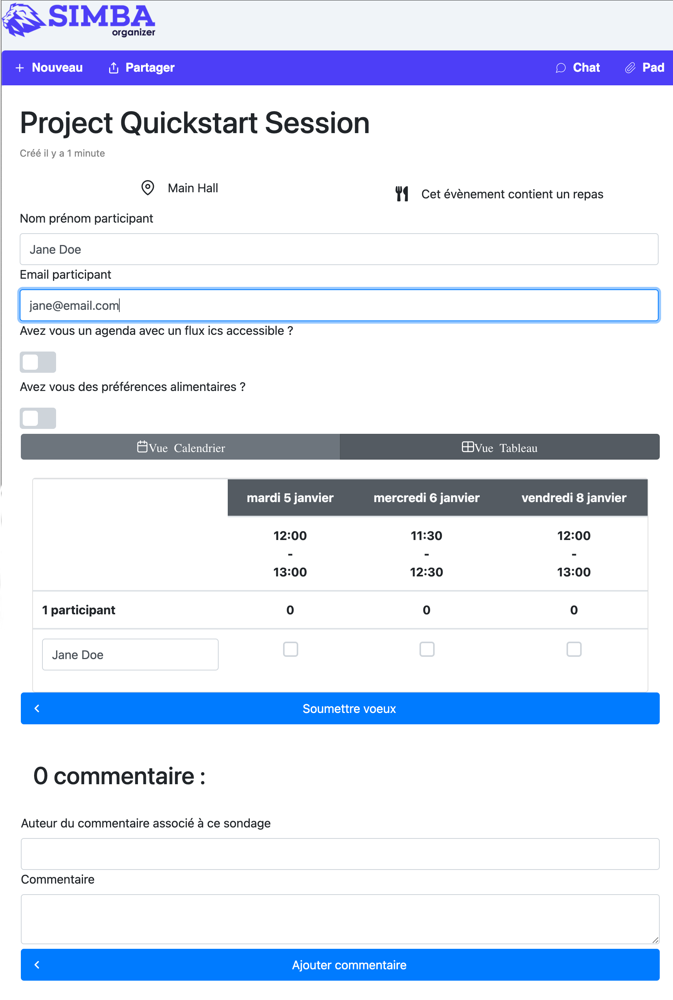

## Page Object Model

The image below shows the poll page of the [Simba Organizer](https://github.com/barais/doodlestudent/) application discussed in classes.



Write in this document the interface of a page object class for this page.

## Answer

```java
package org.example.pages;

import org.openqa.selenium.By;
import org.openqa.selenium.WebDriver;

/**
 * Page Object encapsulates the answer-poll.component
 */
public class AnswerPollComponentPageObject {

  public By nameLocator = By.id("nom");

  public By mailLocator = By.id("mail");

  public By icsLocator = By.id("ics");

  public By descLocator = By.id("desc");

  public By voterNameLocator = By.id("nomvotant");

  public By commentLocator = By.id("comment");

  public By commentDescLocator = By.id("commentdesc");

  public By addWishLocator = By.xpath("//p-button[@label='Soumettre voeux']");

  public By addCommentLocator = By.xpath("//p-button[@label='Ajouter commentaire']");

  protected WebDriver driver;

  public AnswerPollComponentPageObject(WebDriver driver){
    this.driver = driver;
  }

  public void writeName(String name) {
    driver.findElement(nameLocator).sendKeys(name);
  }

  public void writeMail(String mail) {
    driver.findElement(mailLocator).sendKeys(mail);
  }

  public void writeICS(String url) {
    driver.findElement(icsLocator).sendKeys(url);
  }

  public void writeDescription(String description) {
    driver.findElement(descLocator).sendKeys(description);
  }

  public void writeVoterName(String name) {
    driver.findElement(voterNameLocator).sendKeys(name);
  }

  public void writeComment(String comment) {
    driver.findElement(commentLocator).sendKeys(comment);
  }

  public void writeCommentDescription(String description) {
    driver.findElement(commentDescLocator).sendKeys(description);
  }

  public void addWish() {
    driver.findElement(addWishLocator).click();
  }

  public void addComment() {
    driver.findElement(addCommentLocator).click();
  }
}
```
